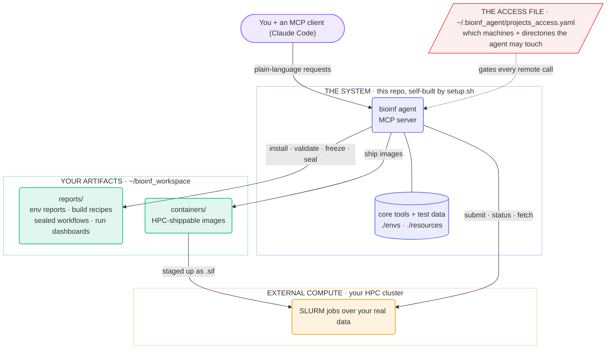

# bioinf-agent

An AI-driven bioinformatics assistant primarily designed to perform the following:

- install bioinformatics tools
- build containerized environments
- bridge data and environments between local and external compute (HPC for now)
- validate the containers / installs worked by running test (or real) data through them
- creates installation reports, environment build recipes, workflow run reports, how-to guides
- create data processing pipelines that leverage the previously installed and validated environments
- intended to scale up bioinformatics workflows reliably via on rails agentic capabilities
- work on your local machine should perform without issue, however only certain HPC features are supported. See below
  - Globus connect for file transfers, scp as fallback
  - SLURM, bash script as fallback
  - Lmod (Lua-based environment module system)
    - apptainer module
    - nextflow module (will run nextflow through a slurm script, as nextflow itself is a management process)

This repo acts as an MCP server for agentic orchestration of bioinformatics on your local and HPC systems. We've tried to 
limit the agent's capacity to perform unintended behavior by leveraging a `projects_access.yaml` file that declares where and how the agent is allowed to do its work, editable in a gui based menu system. Full agent contract found in [CLAUDE.md](CLAUDE.md). The idea is you create an ssh profile and login to the system yourself (if connecting to an HPC). Then the agent can piggy back, run jobs on your behalf using the declared settings / locations from the projects_access.yaml, and experiment in its own scratch space to ensure things actually work before launching larger scale production level jobs (or simply just generating those jobs scripts for you for review). Once you close the connection the agent no longer has access. Installation and setup of environments directly on the HPC can be cumbersome or impossible without the appropriate permissions. Our system by default builds and runs every environment locally as a docker image, and ships to external compute resources as an apptainer `.sif` file to get around these install limitations. 

---

## Quick setup

### Initial local setup

Apart from the code within this repo, you will need Docker (the daemon) running and an MCP client (we specifically developed and tested with Claude Code). Other agents in theory could also drive this system, but we have not tested this. The idea is to clone the repo, run the `setup.sh` and `config.sh` steps to provide the agent with the necessary toolset, context, and locations where it may do work. By default, it will use your home directory to place a bioinf_workspace directory where it can perform its work and will only write there if no other locations are provided.


```bash
git clone https://github.com/monarch-initiative/bioinf-agent
cd bioinf-agent
./scripts/setup.sh          # the system builds itself — allow time for multi-GB downloads
./scripts/setup.sh --check  # systems check only — PASS/FAIL per requirement, every FAIL names its fix
./scripts/config.sh --web   # the settings menu, in your browser (recommended, run without --web option for terminal based menu)
```

## Step 1 — build the system: `setup.sh`

The clone itself is small — git tracks only code. `setup.sh` downloads and builds
everything else **into the repo directory**, untracked. This produces a core set of bioinformatics tools and test files intended to aid in the agent's installation and validation efforts for any given request. This allows the agent to test out any pipelines it creates with available test data, or generate its own given its set of tools. This setup.sh process happens in 5 steps:

- installs a private conda miniforge at `./.miniforge` (never touches any conda your
  machine already has)
- creates the runtime env at `./.conda_runtime` and installs the agent into it along
  with the Globus CLI for file transfers (if applicable)
- pulls the core toolkit env into `./envs/`
- pulls the test-data corpus into `./resources/` — chr22 reference plus real sequencing
  datasets for validating tools (the multi-GB part)
- runs the systems check — every FAIL names its fix

Re-runs will skip what already exists and never delete anything that already exists.

What the agent **produces** — reports, build recipes, staged containers — lands
*outside* the repo, in `~/bioinf_workspace` by default.

## Step 2 — declare your compute: `config.sh`

Step 1 gave you a complete local system. This step tells the agent **what it is
allowed to touch beyond it** — which machines it may compute on, and which of
your directories it may reach. It is technically optional: installing,
validating and freezing tools on this machine needs no configuration at all and will default to a directory in your home called `~/bioinf_workspace`. Declaring external compute and projects is how you use the system at
scale to leverage an HPC cluster running real experiments over your data, with the
agent doing the shipping, submitting and fetching.

```bash
./scripts/config.sh --web        # the settings menu, in your browser (recommended)
./scripts/config.sh --show       # print the current configuration
./scripts/config.sh --validate   # rc 0 when the agent's loader accepts it
./scripts/config.sh              # the same menu, but in the terminal
```

The menu edits one file — `~/.bioinf_agent/projects_access.yaml`. If it isn't declared here, 
the agent isn't meant to touch it. You declare two things: compute environments, and projects, 
along with the permissions allowed for each. 

Hand-editing the file is also fine, but a menu save rewrites it (dropping hand-written
comments) — the previous version is kept with an extra extension of `.bak`.


### Defining compute environments

- **Compute environments** — the machines the agent may use: `local` (this
  machine) and/or `ssh` (an HPC cluster / external compute resource). Each env
  also names the agent's own working zones on that machine — scratch space,
  shared reference data, containers, and reports. All four directories are required to be specified for each compute env with defaults provided. This system was developed around apptainer and nextflow for scaling up bioinformatic workflows. If your system uses an Lmod system for module management, we recommend setting the apptainer and nextflow modules within the configuration menu. These are the module paths you would normally load with a `module load your/module/path/here` command, so the agent knows to use them to run your data.

#### How to leverage an HPC (recommended)
If you want to leverage an HPC to run your bioinformatic workflows, we recommend setting up an ssh profile. To do so, paste the following template into your home `~/.ssh/config` file and change the `HostName` and `User` fields to match your HPC information instead.
```

# ─── hpc-agent ─────────────────────────────────────────────────────────────
# The agent's connection to external compute. Reuses an interactive ssh session
# YOU open via `ssh hpc-agent` so the agent never sees your password.
#
# Daily flow:
#   1. Open a terminal:   ssh hpc-agent     ← prompts for password, opens session
#   2. Leave that terminal sitting.
#   3. Agent's `snapshot_project()` calls piggyback on this open session.
#   4. Close the terminal when done → master connection ends immediately.
#
# ControlPersist=no means the process dies the instant the interactive terminal exits.
Host hpc-agent
    HostName your.cluster.edu
    User yourUserName
    ControlMaster auto
    ControlPath ~/.ssh/cm-%r@%h:%p
    ControlPersist no
```

Then in the `./scripts/config.sh --web` menu set an ssh compute env with `hpc-agent` under the `SSH HOST/ ALIAS` option. If your system uses SLURM and Lmod for software modules, you should set these options accordingly. Before, or during your agent session, you will need to login via `ssh hpc-agent` (and `globus login`, if you configured Globus) in separate terminals. 

### Defining projects

- **Projects** — named pieces of work. A project will define which compute envs it
  may use, and which of **your** directories on those machines the agent may
  see (e.g. your lab's data directory, your run's output directory). These are different directories than the compute envs.


### Permissions for compute envs and projects

- **Directory permissions** — a separate grant per directory, and they don't
  imply each other: `file_name_only` (list what's there), `upload` (put new
  files in), `download` (fetch files out), `exec` (run jobs there). Anything
  not granted is denied, and there is no delete/overwrite grant at all.

**Before work can be done on your HPC system:** open `ssh hpc-agent` in a separate terminal and login to your external compute resource and leave
it open. Every bridge call uses that ControlMaster socket in BatchMode. To confirm a
live session exists run `ssh -O check hpc-agent` or simply ask the agent if running in an interactive mode. 


## Running the system

This repo is an **MCP server**: a local program that holds the agent's tools (install, freeze, run, seal, …),
and waits to be asked to run them. It has no chat interface and no AI of its own, it simply waits for requests from a client. 
The AI lives in an **MCP client**, which hosts the conversation, decides which tool each request needs, and calls it. We developed against [Claude Code](https://claude.com/claude-code), but the tool surface is plain MCP, meaning any MCP client could drive it in theory.

The general idea: **launch your agentic client from this repo's root, on the machine where
you ran setup**. From there the client reads [.mcp.json](.mcp.json), starts the
server automatically as a subprocess, and uses its tools to orchestrate the work —
and that machine is where everything the tools need lives: the Docker daemon, the
built system, your artifact store, and your open ssh session to the HPC.

Three ways to use the system (all use the same engine under the hood):

- **A terminal** — `cd bioinf-agent && claude`, then simply ask/tell the agent about your 
  bioinformatics needs. Approve the `bioinf` server the first time it prompts.
- **The VS Code extension** (recommended) — open the `bioinf_agent` folder and start a
  Claude Code session there. Identical to the terminal underneath; the IDE is just a
  window onto it.
- **Headless, for scripting** — `claude -p "install samtools 1.21 and freeze it"
  --allowedTools "mcp__bioinf__*"` runs one request with no interactive session; the
  tool grant flag is required or every call is denied.
- To give the agent access to your HPC, you will need to login with the ssh profile you setup `ssh hpc-agent`
- To give the agent access to globus connect for file transfers, you will need to login to globus via a `globus login` command

What does **not** work: Claude in the browser at claude.ai. A web session runs on
Anthropic's servers, not your machine — it cannot see your Docker daemon, your built
system, your artifact store, or your ssh session. The
client has to run where the system lives.


## How it works

One agent, three territories: The code repository (the **system** itself), your local machine workspace, optional external compute workspace. The repo is the **system** (rebuildable, disposable);
what it produces lands in your **artifact store** (version-independent, saved outside of the repo);
and everything beyond your machine is reachable only through the **projects_access file**:



---


## Examples

### What it will decide for you — the defaults

You drive the system in plain English, and it fills in whatever you leave unsaid.
Everything below is a default, not a rule — say otherwise in the request and it should do
otherwise. (The last six rows need an external compute env defined in the config step during setup)

| Request | Default behaviour |
|---|---|
| *"Install samtools."* | Installs the latest version. Conda is tried first, and when the community already publishes a pre-built container for the tool, that image is used as-is (pinned by its digest) instead of building a new one. |
| *"Install samtools 1.21."* | Installs exactly 1.21. The report shows the version you asked for next to the version that actually went in, so a substitution can never slip by. |
| *"Install samtools 1.21."* — when this machine solved that last month | Nothing is re-installed: the environment built last time is returned as-is, matched by its digest. You can also just ask *"what's already installed here?"* |
| *"Install somalier 0.9.99."* — a version that was never released | Refused, and the refusal says where it looked. The system never swaps in a different version just to make the request succeed. |
| *"Install cellranger."* — a name that several unrelated tools share | The name alone can't say which one you mean, and the system says so: its suggestion arrives flagged with every project that owns the name (10X Genomics' single-cell pipeline; an R spreadsheet utility) and with how to pin the right one — the wrong tool can never go in silently. |
| *"Install fastp, HISAT2, samtools, and htseq-count."* | All four go into one conda environment — they come from the same packaging world, so they can be installed and run together. Each tool is still validated individually. |
| *"Install HISAT2, htseq-count, and DESeq2."* | HISAT2 and htseq-count share one environment; DESeq2, an R package, gets its own. Each packaging world gets its own environment — mixing a full R stack into a command-line environment makes installs fragile — and the final record states which step ran in which. |
| *"Install this tool from GitHub — it isn't packaged anywhere."* | Built from the authors' own repository, pinned to an exact commit — and every build command is recorded as either lifted verbatim from a named file of theirs or authored by the agent, so the recipe carries its own audit trail. |
| *"Download the human reference genome"* | There is only so much the agent can infer, but will likely result in the latest release of the human genome (hg38.fa) from UCSC or Ensembl being downloaded to the common resources directory with a verifiable URL and traceable provenance. Alt contigs may or may not be included. More specific user supplied context and specification will allow the agent to make the proper decisions for your needs. | 
| *"Install STAR and check that it actually works."* | The latest version will be installed and test read data run through it: a matching test dataset is picked from the bundled corpus and every input is checksummed. "Works" means every output exists, is non-empty, and the run exited cleanly — plus format-specific checks (BAM, VCF, …) where the format is known. |
| *"Download the human reference genome onto the cluster."* | Here, the agent will do its best to avoid using the login node for downloading and or uploading. If a SLURM job manager is selected in the configuration menu, then the download runs through a script submitted to the scheduler (SLURM is only supported for now). If this is not configured, then the download will occur locally, and be pushed up to the cluster via Globus connect if it is configured, or the fallback is scp over the login node (checksum verified after the upload is complete). |
| *"Upload these fastq files to the cluster."* | Copied up, then checksum-verified on the far side before the transfer is called done. Plain scp by default; if you configured Globus, every transfer uses it instead — and a really big one hands back a task id to check on later rather than blocking for hours. This is a generic request, but the more context here the better so the agent knows exactly what you need. |
| *"Make sure this pipeline works on the cluster."* | The pipeline runs in the agent's own scratch area on the cluster — then the outputs are pulled back, validated, and the cluster-side proof goes on the record in the containers and reports directories. |
| *"Run the pipeline over the data in my project directory."* | It writes a readable workflow plus a SLURM launcher, submits the job, saves a record of the submission, and gets out of the way. Ask later *"how's the job doing?"* for status, and *"grab the results"* to fetch the outputs back, verified. |
| *"Submit the job."* — with no account, partition, or memory given | The cluster's declared defaults fill in what you left out; anything still unknown is written on the record as unspecified rather than guessed. It can also read the available partitions and QoS off the live cluster for you. |
| *"Write the outputs to my colleague's directory."* — one you never granted | Refused, before anything touches the cluster. And there is no delete permission to grant at all, while uploads only ever write *new* files — the transfer surface cannot overwrite anything, anywhere. |

### Simple example — install a single tool

> *"Install samtools 1.21"*

What the system does:

- picks the best install route from a ranked ladder, conda first — and for a clean
  conda tool like samtools it doesn't build anything: the community's pre-built
  container image is adopted, pinned by its digest
- validates samtools **inside that exact image** — the check runs in the bytes that
  will ship, not against whatever happens to be on your machine's PATH
- registers the image by its content digest — ask for samtools 1.21 again next month
  and you get the same solved artifact back by hash, no re-install

What you end up with: the environment itself is a **container image in your local
Docker daemon**, registered by digest. Its paper trail lands in `~/bioinf_workspace/reports/`:

| Artifact reports | Description |
|----------|-----------|
| `{name}.ENV.html` | the env report — requested vs installed, evidence, validation locus |
| `{name}.recipe.md` / `.recipe.yaml` | the build recipe — rebuild the image with no agent involved |
| `{name}.attestation.json` | in-toto/SLSA provenance |

| Artifact environments | Description |
|----------|-----------|
| the env image — in your local Docker daemon | for a clean conda tool like samtools, this is the community's pre-built BioContainer, adopted and pinned by content digest (`docker image ls` shows it) — the thing that actually runs; no image file is written anywhere |
| its registry entry — in `~/bioinf_workspace/reports/` | maps your request to that digest, with the full package list and where validation ran — this entry is how the same ask next month comes back by hash instead of re-installing |
| `containers/{name}/{name}.tar` — only once it ships | a registry-free `docker save` of the image, staged in `~/bioinf_workspace/containers/`. The Apptainer conversion happens **on your machine** (apptainer running inside a pinned Linux container, so it works even on a Mac) and only the finished `.sif` is uploaded; until you ship somewhere, none of this exists |

### More complicated example — a full RNA-seq pipeline, local first, then the cluster

> *"Create an mRNA-seq analysis pipeline that takes fastqs to gene-level count tables
> ready for differential expression: fastp for trimming, HISAT2 2.2.1 for alignment,
> htseq-count for counting, DESeq2 for the DE step. Make it work locally first, then
> ship it to the cluster and prove it works there too. Use the genome and annotation
> files in our RNA-seq-project directory for alignment and counting — and if I deleted those,
> re-download them so we can run."*

One request, but it exercises most of the system. What happens, in order:

**It plans before it builds.**
- Checks what is already solved on this machine — an identical env frozen last month
  comes back by digest instead of being rebuilt, and existing test data is reused
  rather than re-downloaded.
- Turns the request into a typed plan and checks it *before* anything runs: every
  step's input must trace to a previous step's output or a declared data source. 
  This plugs holes in the chain of logic now rather than later.

**It builds two environments.**
- The one-env-per-ecosystem default from the table above, applied: `fastp` +
  `HISAT2` + `samtools` + `htseq-count` share one conda env; `DESeq2` gets its own
  R env, validated by actually running it, not just importing it.
- Each env is **frozen**: installed and validated inside the container image that
  ships, registered by digest, with a build recipe that rebuilds it with no agent
  involved. So this is a *multi-env pipeline* — the chain crosses container
  boundaries, and the record says exactly which step ran in which image.

**It validates the whole chain locally, on bundled test data.**
- Runs fastq → trim → align → sort/index → count → DE over the chr22 test corpus
  from `./resources/`, with every step executing *inside* its frozen image — the
  bytes validated are the bytes that ship.
- Every output is validated, every input is sha256-anchored to its source, and
  wall time / peak memory are recorded per step.

**It seals the validated run.**
- The run becomes a machine-verified workflow spec plus a human-readable run
  dashboard. Sealing *refuses* if any step's evidence doesn't hold — an output that
  failed validation cannot be talked into the record.

**Then it goes to the cluster.**
- Ships each frozen image up as an Apptainer `.sif` (checksummed, idempotent —
  already-staged images are skipped).
- Looks in your RNA-seq-project's granted directories for the genome + annotation.
  Gone? It re-downloads them **directly onto the cluster** (no laptop round-trip)
  and records their checksums — sealing re-verifies them, so a reference that
  changed underneath you fails loudly.
- Re-runs the validation chain in its own scratch sandbox *on the cluster*, so the
  record carries cluster-side proof, not just local proof.

**Then production, over your real data.**
- Renders a human-readable workflow + SLURM launcher (you can open `main.nf` and
  copy-paste any step's literal command), submits, and records a submission
  manifest — it does not babysit day-long jobs. Ask later: *"how's the RNA-seq run
  doing?"* → scheduler-backed status; *"grab the results"* → outputs fetched back
  checksum-verified.
- Every path it touches must fall inside a directory your step-2 config granted,
  with the right permission — anything else is refused before a single ssh happens.

What you end up with, in `~/bioinf_workspace/reports/`:

| Artifact reports | Description |
|----------|-----------|
| `{env}.ENV.html` — one per env, so two | the env reports — requested vs installed, evidence, validation locus |
| `{env}.recipe.md` / `.recipe.yaml` — one per env | the build recipes — rebuild either image with no agent involved |
| `{env}.attestation.json` — one per env | in-toto/SLSA provenance |
| `{name}.workflow.yaml` | **the sealed workflow spec** — the machine-verified record of the run: every step, every input traced to its source, both env digests pinned. Self-contained: it re-checks its own invariants without this repo in the loop |
| `{name}.RUN.html` | **the run dashboard** — what ran, on which data, in which image, with the evidence per compute locus (local and cluster) and the proven how-to commands |
| `job_submissions/{project}/{name}_{job_id}.submission.json` | one manifest per cluster submission — everything a future session needs to find and follow up on that job |

And the environments themselves:

| Artifact environments | Description |
|----------|-----------|
| two env images — in your local Docker daemon | the CLI env (fastp + HISAT2 + samtools + htseq-count) and the R env (DESeq2), each a Docker image content-addressed by digest and registered in the env registry |
| `containers/{env}/{env}.tar` — one per env | registry-free `docker save` tarballs of those images, staged in `~/bioinf_workspace/containers/` for shipping |
| two `.sif` images — on the cluster | built **on your machine** (apptainer-in-docker; the cluster never builds or pulls anything) and uploaded as finished files to the cluster's declared container zone, named `{env}_{digest}.sif` — content-digest names, so a re-freeze never clobbers the old one |

Plus **your count tables and DE results in your project directory** — and asking
for this pipeline again returns its frozen envs **by hash**: it is now a reusable,
provable component.

### One environment, three forms

The canonical form of every environment is a **Docker image, addressed by content
digest** — everything builds, validates, and runs locally in that form, and no
Apptainer is involved in local work at all. When an env ships to a cluster it is
repackaged, not rebuilt: a `docker save` tarball for transport, converted **on your
machine** to a `.sif` (the container format HPC clusters allow), still named by the
same digest. Those two derived forms don't exist until you ship. Same bytes, two
runtimes — a pipeline proven locally and one running on the cluster execute the
identical environment.

### When the agent asks something of you

- **A first freeze often reports `degraded`, with named reasons.** That is the contract
  talking, not a failure: the env is registered and shippable, and the tag says how much
  was *observed*. Each reason names what would close it — act on it or accept it.
- **License-gated tools** (Novoalign-class) are never fetched by the agent. Download the
  artifact under your own license and hand the local path over; the agent freezes it
  license-gated, so the record carries `redistributable: false` and the image is
  delivered tarball-only.

A client isn't even required — `python -m agent` runs the server directly. And the
sealed artifacts (`workflow.yaml` + `recipe.yaml` + image digest) are designed to be
self-contained — the spec re-checks its own invariants standalone — so another agent
or system can consume them without this repo in the loop.

---

## Tests

pytest lives in the runtime env, so run it on that interpreter:

```bash
./.conda_runtime/bin/python -m pytest                                           # the project suite
./.conda_runtime/bin/python -m pytest -m "not live and not integration_docker"  # fast hermetic tier (what CI runs)
./.conda_runtime/bin/python -m pytest -m live                                   # opt-in: hits real package registries
```

## Docs

- [CLAUDE.md](CLAUDE.md) — the full honesty contract, every primitive, and the protocol.
- [docs/](docs/) — architecture, the HPC bridge, and the outcomes/intent dashboards.

## License

BSD 3-Clause — see [LICENSE](LICENSE).
