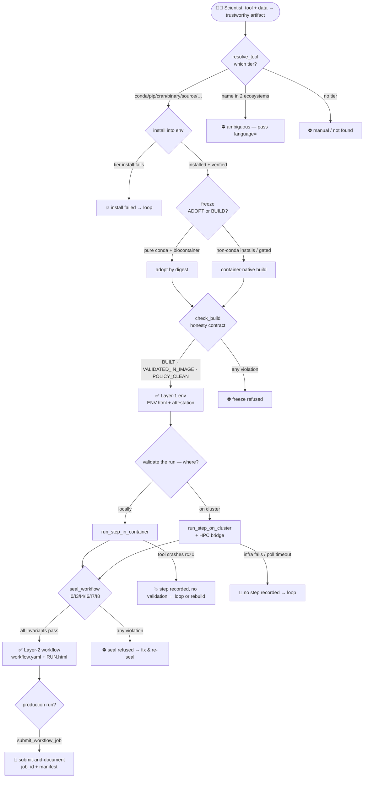

# The Scenario Decision Tree

Top-down map of everything that can happen when a scientist drives the agent from
"I have a tool + some data" to a trustworthy artifact. Two layers:

- **Layer 1 — the environment** (`resolve → install → freeze`) → `{env}.ENV.html`
- **Layer 2 — the workflow** (`run locally | run on cluster → seal`) → `{wf}.RUN.html`

Built from an exhaustive branch inventory of the code (every `if` / refusal /
early-return across the install, freeze, bridge, run, and seal primitives). The
code gives the **skeleton**; the **scenario leaves** are hand-annotated (the code
collapses "segfault / missing lib / wrong arch / OOM" into one branch: `rc != 0`).

---

## Legend — the terminal outcomes

Every path ends in one of these. The symbol is the whole point: it shows *how* a
thing ends, and where the honesty holes are.

| Symbol | Outcome | Meaning |
|---|---|---|
| ✅ **PROVEN** | honest green | env frozen & validated-in-image, or workflow sealed with validated evidence |
| ⛔ **REFUSED** | loud, honest, recoverable | a gate/invariant said no *before* writing anything — the system refuses to fake success |
| 💥 **BROKE** | loud hard failure, **recorded** | something failed and it's captured (install rc≠0, build fail, tool crash rc≠0, ssh down) — agent loops |
| 👻 **VANISHED** | loud to agent, **not recorded** | failed with no durable trace in the draft (cluster infra fails, poll timeout) — the thin spot |
| ⚠️ **DEGRADED** | proceeded, weaker assurance | ran but with reduced proof (C2 observed-only, emulated I7 timings) |
| 🔁 **LOOP** | recoverable, feeds back | a state that informs a retry (missing R deps, sacct not-yet-in-db) |

The design intent (per "break loudly, minimal moving parts"): maximise ✅/⛔/💥,
shrink 👻. Everywhere you see 👻 below is a candidate for future hardening.

---

## The spine (visualize top-down)



---

## STAGE 0 — Resolve the tool → pick a tier  (`resolver.py`)

```
Q: where does this tool live?
├─ found on conda (bioconda/conda-forge)        → tier=conda        → STAGE 1 ✅ (preferred)
├─ found on PyPI only                           → tier=pip          → STAGE 1
├─ found on CRAN/Bioconductor only              → tier=cran/bioc    → STAGE 1
├─ github_repo given → release asset            → tier=binary       → STAGE 1
├─ github_repo given → buildable source         → tier=source       → STAGE 1
├─ found on BOTH PyPI and CRAN, no language=    → ⛔ ambiguous=true — "pass language='python'|'r'"
├─ github_repo given, but PyPI/CRAN name does
│   NOT reference that repo                      → tier disqualified (cross-namespace collision)
│                                                  e.g. PyPI 'gab' ≠ baumannlab/Genome_Assembly_Booster
└─ nothing anywhere                             → ⛔ manual / not found → scientist decides
```

---

## STAGE 1 — Install into the env  (`env_tools.py`, per tier)

```
Q: did the tier's install succeed AND verify?
├─ CONDA
│   ├─ solver rc=0                               → ✅ installed
│   └─ solver rc≠0 (conflict / mirror down)      → 💥 install failed → loop (relax pins / channel)
├─ PIP
│   ├─ install rc=0 AND import check passes      → ✅ installed
│   └─ install rc=0 BUT import fails             → 💥 success=false (pip "installs" broken dep silently)
├─ R (cran / bioc / github)
│   ├─ unknown source type                       → ⛔ error before Rscript runs
│   ├─ install rc=0 AND requireNamespace loads   → ✅ installed
│   ├─ install rc≠0, stderr names missing deps   → 🔁 missing_packages[] → install deps, retry
│   └─ install rc=0 BUT namespace won't load     → 💥 success=false (load-or-die)
├─ BINARY (release / vendor URL)
│   ├─ sha256 matches AND smoke verify runs      → ✅ installed
│   ├─ sha256 MISMATCH                            → 💥 HARD FAIL, step not merged (wrong bytes)
│   └─ sha256 ok BUT won't exec (wrong arch)     → 💥 verify catches libc/CPU mismatch
├─ SOURCE (git clone + build)
│   ├─ neither bin_path nor entrypoint (or both) → ⛔ ambiguous shape error
│   ├─ host_build=false                          → build DEFERRED to freeze image (cross-arch)
│   └─ build + smoke verify ok                   → ✅ installed (anchored by commit_sha)
├─ PERL (cpanm)
│   └─ perl -M{module} -e1 loads                 → ✅ / else 💥 (cpanm exits 0 with broken XS)
├─ CARGO / GO
│   └─ build ok → cli_which anchor + toolchain version recorded → ✅
├─ JAR
│   └─ download+extract → heuristic jar pick (name match, shortest) → ✅
└─ SYNTHESIS (agent-authored long-tail)
    ├─ fetch fails                                → ⛔ early error (no docker build wasted)
    ├─ anchor drift (commit/sha256 moved)         → ⛔ refuse (provenance broke)
    └─ agent-authored URL not found in repo       → ⛔ validate_submission refuses
```

---

## STAGE 2 — Freeze → the Layer-1 env artifact  (`freeze_tools.py`, `env_honesty.py`)

```
Q0: can we even start?
├─ free disk < threshold                          → ⛔ refuse early (A1) — "docker buildx prune"
├─ gated=true AND licenses[] empty                → ⛔ refuse early (F2/I13) BEFORE build cost
└─ else → Q1

Q1: EnvCache hit?  (request_key = tools + versions + platform + accel policy)
├─ hit AND image still in daemon                  → ✅ return proven artifact by hash (no re-solve)
├─ hit BUT image evicted from daemon              → miss → rebuild (never serve a stale record)
└─ miss → Q2

Q2: ADOPT or BUILD?
├─ pure conda + public biocontainer found
│     AND not gated AND no env-mutating steps     → ADOPT path (Q3a)
├─ has non-conda installs / pip-via-run_in_env    → BUILD path (Q3b) — biocontainer can't represent it
├─ gated=true                                     → BUILD path (I13: gated is NEVER adopted)
└─ biocontainer lookup:
      ├─ exact version tag found                  → adoptable
      ├─ version set never pre-built upstream      → miss → BUILD
      └─ quay.io API network error                 → treated as miss → BUILD (no crash)

Q3a: ADOPT honesty  (check_adopt — POLICY_CLEAN only, trusted by digest)
├─ I12 accelerator + I13 license pass             → ✅ adopted by digest (no VALIDATED_IN_IMAGE — bytes trusted, not run)
└─ violation                                       → ⛔ refuse

Q3b: BUILD honesty  (build in-container, then check_build)
├─ a non-conda install is non-replayable
│     (source w/o bin_path, binary w/o platform
│      asset, unreachable sha256)                  → ⛔ error BEFORE docker build
├─ docker build stage fails:
│     ├─ base image unpullable                     → 💥 BUILT fails (no image at all)
│     ├─ conda solve conflict / package gone       → 💥 build fails
│     └─ long-tail cmd rc≠0 (wrong-arch, build err)→ 💥 build fails
└─ image built → check_build:
      ├─ BUILT: image + digest resolve in daemon   → else ⛔ BUILT.image_present
      ├─ VALIDATED_IN_IMAGE: every tool re-runs
      │    green in the shipped image, referencing
      │    the tool as a real token                 → else ⛔:
      │      ├─ no evidence collected               → VALIDATED_IN_IMAGE.no_evidence
      │      ├─ echo/true/:/[ 1=1 ] cheat shape     → evidence_shape violation
      │      └─ tool absent or rc≠0 in image        → evidence_passed violation
      ├─ POLICY_CLEAN:
      │    ├─ I12 cuda/rocm w/o toolkit_version      → ⛔
      │    ├─ I12 runtime_verified w/o probe+driver  → ⛔
      │    ├─ I12 mps not dev_only                   → ⛔
      │    └─ I13 gated but redistributable/no license→ ⛔
      └─ PROVENANCE_CLEAN (synthesis): empty cmds
           or untagged source                        → ⛔
      → all pass → ✅ Layer-1 env

Q4: delivery
├─ adopt                                           → apptainer pull docker://…@digest
├─ build + registry/push_target, push ok           → apptainer pull docker://ref
├─ build + push FAILS                               → ⚠️ tarball fallback (reported, never silent)
├─ build + gated                                    → tarball only, NEVER pushed (I13)
└─ build + no registry (default)                    → docker save → apptainer build (registry-free)
→ writes ENV.html (immutable) + attestation.json
```

---

## STAGE 3A — Validate LOCALLY  (`run_step_in_container`)

```
Q: run the step inside the frozen image
├─ no pipeline_id / no frozen env / record has no image → ⛔ refuse (call freeze first)
├─ Docker daemon is REMOTE (DOCKER_HOST)                → ⛔ refuse (can't bind-mount local data)
├─ adopted image not local AND pull fails               → ⛔ refuse
├─ container runs, rc=0
│   ├─ each output type-validated, all pass             → ✅ validated step (feeds seal)
│   ├─ an output FAILS type validation (bad BAM/VCF/JSON)→ ⚠️ recorded passed=False → seal will REFUSE (C1/I3)
│   └─ measured under emulation (arm64→amd64)           → ⚠️ I7 stamped not-authoritative (timings unreliable)
└─ container runs, rc≠0 (tool crash / missing lib / wrong flag)
    → 💥 step recorded with rc≠0, NO validation run → loop (fix cmd) or REBUILD env (Stage 2)
```

---

## STAGE 3B — Validate ON CLUSTER  (`run_step_on_cluster` + HPC bridge)

The bridge plumbing (auth / transfer / ssh) cross-cuts every cluster step.

```
Q-auth: can the agent touch this cluster at all?
├─ projects_access.yaml missing / malformed        → ⛔ ConfigError
├─ compute env not type=ssh                         → ⛔ refuse
├─ env has no agent_scratch_target                  → ⛔ hard-fail (no sandbox to work in)
├─ project lacks env access / scratch lacks exec    → ⛔ PermissionDenied
├─ ssh session not open (no ControlMaster)          → 💥 rc255 → hint "open ssh hpc-agent" (actionable)
├─ transfer zone breach (scratch path not under
│    <scratch>/<project>/…; wrong permission token) → ⛔ PermissionDenied (discrete: upload≠download≠exec)
└─ unsafe token (job_id, path, module has metachar) → ⛔ refuse BEFORE any ssh

Q-input: are declared inputs already on the cluster?  (remote_paths_exist — loud precheck)
├─ all inputs present                               → proceed
└─ any input missing                                → ⛔ refuse BEFORE sbatch (no auto-staging; user's rails own data)

Q-stage: get the .sif onto the cluster
├─ no container_upload_target (build-archive)        → ⛔ refuse (no fallback zone)
├─ tar upload / apptainer pull|build fails           → ⛔ refuse
├─ .sif already staged                               → idempotent skip
└─ staged → C2 fingerprint (inspect_staged_sif):
      ├─ label source digest == pinned env digest    → ✅ cryptographically verified
      ├─ no comparable digest (build_archive)         → ⚠️ observed-only (sha256 + inspect-ok)
      └─ inspect fails / SIF_MISSING                   → ⚠️ cluster_image_verified=False

Q-transfer (wire protocol, per env.data_transfer):
├─ scp_head_node, file > 5 GiB                       → ⛔ refuse (use globus)
├─ scp, sha256 round-trip MISMATCH                    → 💥 file unlinked, refuse (corrupt)
├─ no-overwrite: remote file exists                   → ⛔ refuse
├─ globus sync → SUCCEEDED (end-to-end checksum)      → ✅
├─ globus async → "submitted" (task_id)               → 🔁 MUST confirm via globus_task_status
│      ├─ later SUCCEEDED → manifest → "uploaded"      → ✅ (half-baked-transfer defense)
│      └─ later FAILED    → manifest → "failed"        → 💥
└─ globus consent / accessible-folders misconfig      → 💥 hard error (never silent scp fallback)

Q-run: submit + poll + fetch
├─ render main.nf/config/launcher fails               → ⛔ refuse
├─ upload of a rendered file fails                    → ⛔ refuse
├─ sbatch fails (bad partition/account, sbatch gone)  → 👻 refuse — NO step recorded, files leaked in scratch
├─ poll exceeds cap (default 60 min) no terminal      → 👻 refuse — job may STILL be running, NO step recorded
├─ job terminal, rc≠0 (crash / OOM / missing lib)     → 💥 step recorded rc≠0, NO validation → loop / REBUILD
├─ job terminal, rc=0 BUT sacct query errored         → ⚠️ resource_usage all-zeros + sacct_error → seal REFUSES (C3/I7)
├─ output download fails                              → ⚠️ download_errors[], partial outputs unvalidated
└─ job rc=0, outputs downloaded + type-validated       → ✅ cluster-locus validated step (feeds seal)
```

---

## STAGE 4 — Seal → the Layer-2 workflow artifact  (`seal_workflow`, `spec_writer.py`)

```
Q-pre:
├─ unknown pipeline_id / no frozen env              → ⛔ refuse
└─ else → invariant gauntlet (refuse on ANY):

I0 shape        ├─ a list field holds a non-dict                     → ⛔
I3 outputs      ├─ rc=0 step produced NO outputs (not marked)         → ⛔ silent-empty-success
                ├─ outputs exist but never validated                  → ⛔
                ├─ an output's validation is passed=FALSE (C1)         → ⛔ can't seal a proven-bad output
                └─ validation used expected_type="any"                → ⛔ lazy (touch foo.bar would pass)
I6 paths        ├─ a relative input/output path                       → ⛔ repro landmine
                └─ usage template {PLACEHOLDER} not declared          → ⛔ typo/undeclared slot
I7 resources    ├─ rc=0 step has no resource_usage                    → ⛔ monitor never saw it run
                ├─ resource_usage carries sacct_error                 → ⛔ (C3) fabricated zeros
                └─ resource_usage all-zeros                            → ⛔ (C3) no honest cost data
I8 provenance   ├─ a step input traces to no source                  → ⛔ orphan (doesn't compose)
                ├─ authored artifact missing / sha256 drifted         → ⛔ spec claim ≠ disk
                └─ same-path bytes changed between steps              → ⛔ lineage mutated
I4 usage        ├─ usage.command_template self-test FAILS (H2)         → ⛔ won't ship a broken runnable form
                └─ NO usage block                                      → skip (seals without usage_verified badge)
self-verify     └─ constructed spec fails its OWN invariants          → ⛔ wouldn't re-verify standalone

→ ALL PASS:
   ├─ write {wf}.workflow.yaml + {wf}.RUN.html
   ├─ validated_in_shipped_image = (every validated step's digest matches a frozen env) — else badge False
   └─ usage_verified = (I4 passed)                                    → ✅ SEALED

⚠️ KNOWN GAP (the thin spot, per our break-loudly chat):
   a workflow whose ONLY step FAILED (rc≠0) with NO usage block hits zero
   invariant violations (failed steps are skipped by I3/I7/I8) → it SEALS.
   Badges are all False (not a lie), but it's a sealed artifact for a run that
   never worked, and RUN.html doesn't yet mark the step FAILED.
```

---

## STAGE 5 — Production run  (`submit_workflow_job`)

```
Q: submit the sealed workflow against the user's real workspace
├─ workflow_dir empty                               → ⛔ refuse (must be explicit)
├─ workflow_dir not in directories[] with upload+exec→ ⛔ PermissionDenied
├─ render/upload/sbatch fails                        → ⛔ refuse (with forensic launcher path)
└─ sbatch ok → 📄 submit-and-document: returns job_id + writes
     job_submissions/<project>/<wf>_<job_id>.submission.json
     (NO polling — production jobs run for hours; agent's watchdog would kill a wait)
     → later: cluster_job_status → download outputs
```

---

## Where the honesty holes cluster (the 👻 map)

The spine is overwhelmingly ✅ / ⛔ / 💥 — it breaks loudly and won't fake green.
The 👻 (loud-but-not-recorded) leaves are concentrated in exactly one place:

| 👻 leaf | Where | Why it vanishes | Cheap fix later |
|---|---|---|---|
| sbatch fails on cluster | Stage 3B | early return before the step is built; rendered files leaked in scratch | record a failed-attempt stub in the draft |
| poll timeout | Stage 3B | 60-min cap hit; job may still be running; no step | record the job_id + "unterminated" attempt |
| wholly-failed workflow seals | Stage 4 | failed steps are skipped by every invariant | refuse to seal if zero validated steps; mark failed steps in RUN.html |

⚠️ **DEGRADED** leaves (proceeded with weaker proof) are honest but worth a glance:
emulated I7 timings (Stage 3A), C2 observed-only sif verification (Stage 3B),
tarball-fallback delivery (Stage 2).

Everything else that can go wrong **breaks loudly and recoverably** — which is the
posture we chose. The rebuild loop (validation 💥 → back to Stage 2 with a fix) is
agent-driven and manual by design.

---

## Can this be regenerated from code?

**Partly — and the split is the point.**

- **The skeleton IS extractable.** Every node above maps to a real branch: an `if`,
  a `return {"error": …}`, an invariant clause. An AST pass over the primitives
  could emit the branch graph (guard + outcome + `file:line`) and stay in sync as
  the code changes. ~1 day of work; produces the ⛔/💥 structure automatically.
- **The scenario leaves are NOT.** The code has one branch — `if rc == 0` — behind
  which sit segfault, missing `.so`, wrong arch, OOM, bad flag, corrupt input.
  Those are runtime/domain realities the code forwards, not decisions it makes.
  They must be hand-annotated (this doc).
- **The outcome vocabulary (✅⛔💥👻⚠️🔁) is semi-derivable:** ⛔ = returns `error`
  before writing; 💥 = records a failed step; 👻 = returns error with no record
  written. A heuristic AST classifier could tag most leaves; a human confirms.

So the sustainable form is a **hybrid**: auto-generate the skeleton + outcome tags
from code on each change, keep the scenario leaves as a hand-maintained overlay
keyed by `file:line`. Not an off-the-shelf tool — but a small, real script.
